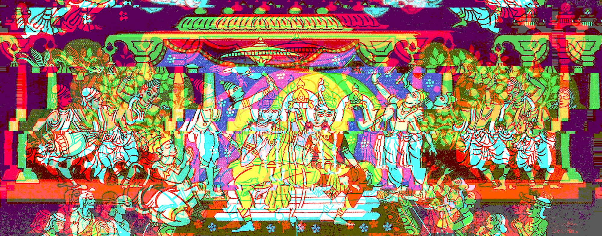
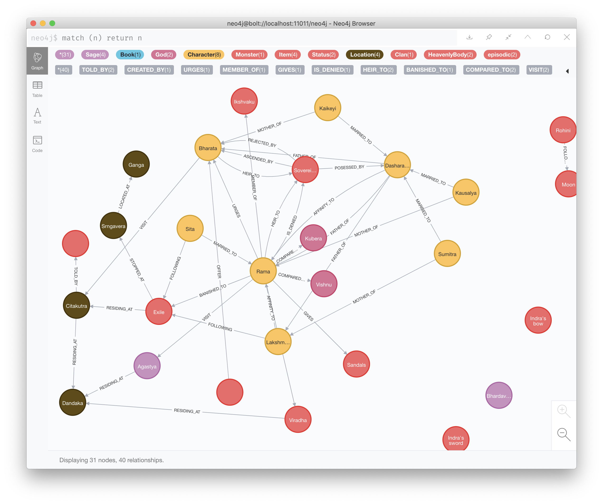

# The Ramayana — the jorney on the edges, node by node

## रामायणम्
The Ramayana is one of the three (if we consider Bhagavat Gita as an independent entity, rather than a part of Upanishads) epics from ancient India. The authorship of the work is attributed to Valmiki, though it is most certainly a body of work of several people.

## What is this then:
This is a graph with the full consideration of every mentioned character, location and event in the Ramayana. The source is represented in a set of commands in [Cypher](https://www.opencypher.org/) and is split by chapters in the book.

Attention: in order to keep flexibility, no preloading of the old items is present and only new characters are defined in each chapter. There are two ways to make it work:

1. Merge all files into one
2. Load each chapter individually (in descending order) and run `MATCH (n) RETURN n` before each new load

Approximate current state of affairs:

_work in progress_
